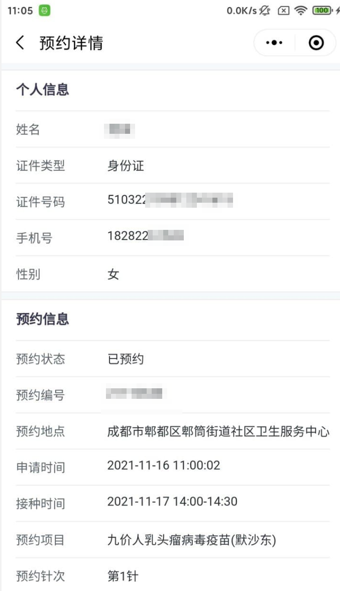

# 知苗易约Xposed版

## 使用

1. 必须安装[8.0.15](https://www.wandoujia.com/apps/596157/history_v2020)版的微信
2. 安装EdXposed
3. 安装微X模块和[本模块](https://github.com/zzyandzzy/xp-zhimiao/releases/download/1.0/app-release.apk), 授予微信`存储权限`
5. 点进去知苗易约小程序, 选择一个医院, 正常情况下会自动复制`Cookie`、`Signature`和医院ID, 有Toast提示复制成功就行
6. 点进本模块程序, 点击获取用户信息成功后设置好`接种时间`提高抢购成功率, 到`抢购时间`的时候疯狂点击抢购吧!

## 问题

1. 数据存储在`/sdcard/wx_hpv/config.json`

## 成功截图

